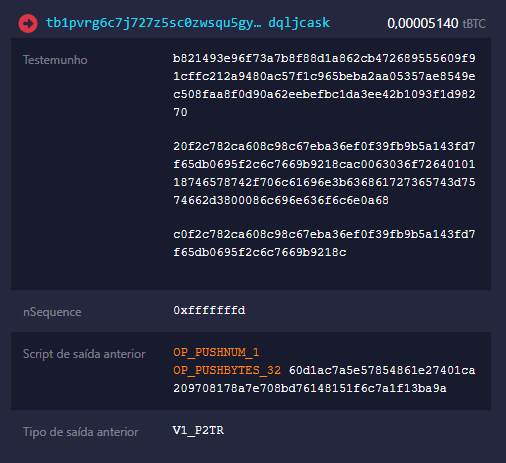

# Deterministic inscription transaction hash
> It is NOT possible to generate the transaction hash of the inscription without the final inscription content because we can't use arbitrary utxos as the input for the reveal transaction.

## Q/A
1. **Is it true that changing only the witness data does not change the transaction hash?** Yes, that is true. However, such a change would invalidate the transaction because the entire witness data is used to validate whether the previous output can be spent or not (the UTXO created by the commit transaction). Even the script after `OP_FALSE OP_IF...` is included in the validation process.
1. **What if we don't use the commit tx at all?** The commit transaction is not the villain here, it is helpful as it sets up a P2TR utxo so that we can spend it using the taproot *script path* [(See appendix 1)](#appendix-taproot-signature-paths), providing the witness `[signature, script, control_block]` as the unlocking script (a valid inscription creation witness). If we use an arbitrary utxo, such as P2PKH, we would not be able to spend it by providing our 3-element witness data.
2. **Why not create the P2TR utxo ourselves instead of using the commit tx?** While it's possible to create a P2TR utxo using our public key as the unlocking script, we would then need to spend this utxo using the taproot *key path* [(See appendix 1)](#appendix-taproot-signature-paths), this involves signing the input with our private key using  `sign_raw_transaction_with_wallet` which would result in our transaction input having `[signature]` as the witness data instead of a valid inscription creation witness.
3. **Why don't we use Replace-by-fee to double spend the utxo with our final witness data?** We can broadcast a transaction with a valid inscription but empty content and use a large `locktime` to make this transaction never be mined, and then create a second transaction replacing this. But the problem is, for Replace-by-fee to work with a taproot *script path* signature, we can't make changes to the input's witness data. Any change would result in a different `[signature, script, control_block]` tuple that cannot be used to unlock the same utxo spent in the replaceable transaction.

## ORD bugs found
1. Broadcasting an inscription creation transaction and then broadcasting a second transaction using Replace-by-fee to replace the first one will cause the indexer to break with the error `"reorg detected"`.


## Appendix: Taproot signature paths
P2TR utxos can be spent using either the *key path* or the *script path*.

### Key Path  
For example, the following can be signed using the *key path*


The **key path** is a simple method of spending a P2TR utxo by using `sign_raw_transaction_with_wallet` with the taproot private key associated with the public key used in the utxo. The resulting signature would be used as the witness data on the transaction input, without requiring the use of additional scripts or conditions.

utxo spent using the *key path*:


### Script Path
Now, this particular example can be signed using either the *key path* or the *script path* (unlike the previous example, which only works with the *key path*).


utxo spent using the *script path*:



To sign using the *script path*, we need to manually create the witness tuple `[signature, script, control_block]` that unlocks this utxo. This tuple has a surjective relation with the `scriptPubKey`.


Lets see in practice how ord is doing this when creating the commit and reveal transactions:
```rust
// create the unlocking script for the reveal transaction
let reveal_script = inscription.append_reveal_script(
  script::Builder::new()
    .push_slice(&public_key.serialize())
    .push_opcode(opcodes::all::OP_CHECKSIG),
);

// create the taproot merkle tree
//     root
//      |
// reveal_script
let taproot_spend_info: bitcoin::util::taproot::TaprootSpendInfo = TaprootBuilder::new()
  .add_leaf(0, reveal_script.clone())
  .expect("adding leaf should work")
  .finalize(&secp256k1, public_key) 
  .expect("finalizing taproot builder should work");

// create the merkle proof for the `reveal_script` leaf
// this merkle proof contains all the complementary information needed to derive the merkle root
let control_block = taproot_spend_info
  .control_block(&(reveal_script.clone(), LeafVersion::TapScript))
  .expect("should compute control block");

// derive the scriptPubKey to be used on the commit's output
let commit_tx_address = Address::p2tr_tweaked(taproot_spend_info.output_key(), network);
let commit_script_pubkey = commit_tx_address.script_pubkey();
```
Now we can build the tuple `[signature, reveal_script, control_block]` that unlocks the `scriptPubKey`. Note how these two elements are tied together and there is no other witness tuple that could unlock that utxo.

In order to have a second witness tuple unlocking the same utxo we would have to re-create the taproot merkle tree and it would result in a different `scriptPubKey`, therefore a different commit transaction.

```rust
//              root
//           /       \
// reveal_script   unlocking_script
let taproot_spend_info = TaprootBuilder::new()
  .add_leaf(1, reveal_script.clone())
  .expect("adding leaf should work")
  .add_leaf(1, unlocking_script.clone())
  .expect("adding leaf2 should work")
  .finalize(&secp256k1, public_key)
  .expect("finalizing taproot builder should work");
```

In this case, a reveal transaction could have either `reveal_script` or `unlocking_script` composing the input witness data. Note how we can't use a script that wasn't added to the merkle tree.
