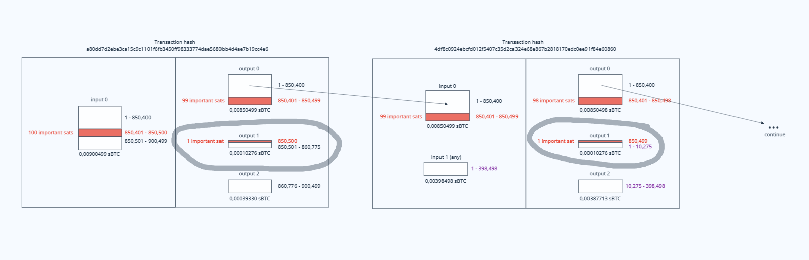
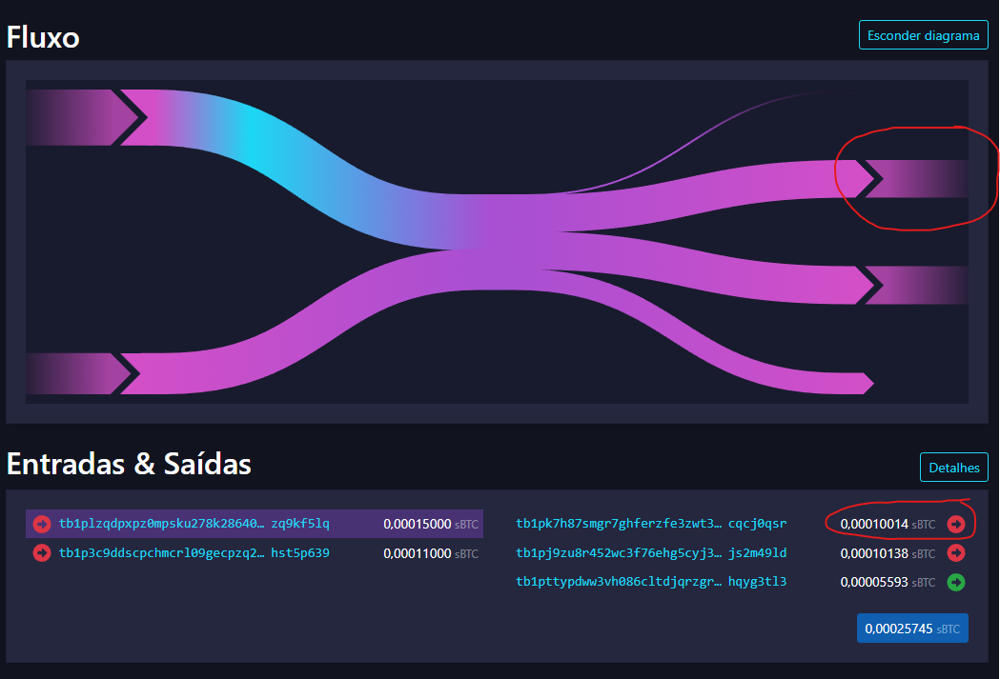

# ord wallet inscribe-chain
> Broadcast a transaction chain to the mempool inscribing 10 ordinals, each containing one special sat extracted from a designated output.



## Requirements
1. utxo containing special sats must be padded with at least 1,000 normal sats at the beginning
2. if the utxo has more than one range of special sats, start with the last sat of the last range, because everything below that will be trimmed.
3. for each iteration, 10 inscriptions being created in one block, wallet must have 10 additional available utxos with enough sats for each inscription because 1 sat will come from the special utxo and the other 9,999 will come from any other normal utxo available in the wallet. **Important**: each of these prepared utxo's also needs to be large enough to pay the chosen fee rate for the inscription.
4. files to be inscribed must be named as `<number>.<extension>`, the inscribing will take place in that order.

## Example
1. Create the files to be inscribed:
    ```bash
    mkdir files/
    echo "1" > files/1.txt
    echo "2" > files/2.txt
    echo "3" > files/3.txt
    echo "4" > files/4.txt
    echo "5" > files/5.txt
    echo "6" > files/6.txt
    echo "7" > files/7.txt
    echo "8" > files/8.txt
    echo "9" > files/9.txt
    echo "10" > files/10.txt
    echo "11" > files/11.txt
    echo "12" > files/12.txt
    echo "13" > files/13.txt
    echo "14" > files/14.txt
    echo "15" > files/15.txt
    ```
2. Get the special utxo
    ```bash
    ord wallet outputs
    ```
    ```json
    [
        {
          "output": "7f320d87dd2d011ba9a3dbc66c46aed4b0b3a9a0a4d1c93fe3ed97ab280463f5:8",
          "amount": 15000
        }
    ]
    ```
    Lets pick sats from `10_001` to `10_015` as the special ones, so my `satpoint` is:
    ```
    7f320d87dd2d011ba9a3dbc66c46aed4b0b3a9a0a4d1c93fe3ed97ab280463f5:8:10014
    ```
3. Run the `inscribe-chain` command
    > **Note**
    > You must have at least 10 additional available utxos, each containing a minimum of 12,000 sats, when running this command. If you don't have enough, use the `ord wallet split` command to break one of your larger utxos into several smaller ones..

    ```bash
    ord wallet inscribe-chain --fee-rate=1.0 --satpoint=7f320d87dd2d011ba9a3dbc66c46aed4b0b3a9a0a4d1c93fe3ed97ab280463f5:8:10014 files/
    ```
    The sats `10015`, `10014`, `10013`, `10012`, `10011`, `10010`, `10009`, `10008`, `10007` and `10006` were extracted from the special utxo and given to the inscribed files `1.json`, `2.json`, ... `10.json` in this order.

4. Now we have to **wait for the block to be mined** and then run the next command (that was given when the previous completed):
    > **Warning**
    > If you run the following command while the previous transaction chain is still pending in the mempool, you will be able to inscribe only 2 more inscriptions and will have a commit transaction without the reveal. In other words, it will waste valuable special sats and will require a manual task to fix the transaction chain.
    ```bash
    ord wallet inscribe-chain --fee-rate 1 --satpoint d3ecd1d753e09d2ca3a69fe1a36a7b829e3c096d44f101d11c5a3f6aef1e757b:0:10004 files/
    ```

And this is the full chain:  
https://mempool.space/pt/signet/tx/58a7f430fbd5933d7f2dbcb9b2e1b4aaeea3af47a965c1a8917fa05bbf854a45#flow=&vin=0  


If we navigate through the first outputs we can see all the 10015 to 10001 sats being added to the commit outputs and then to the reveal output.
